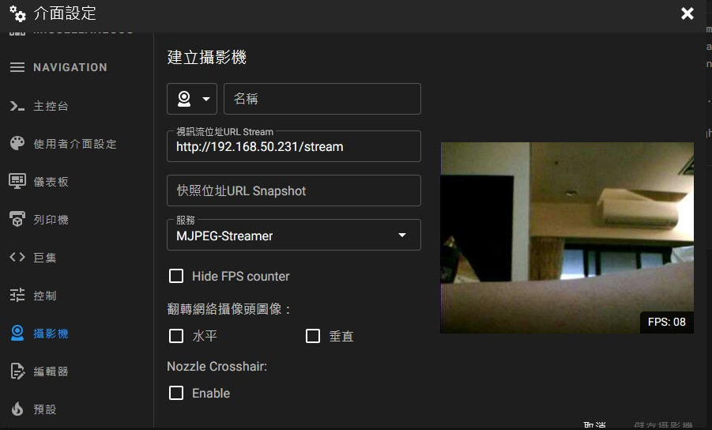
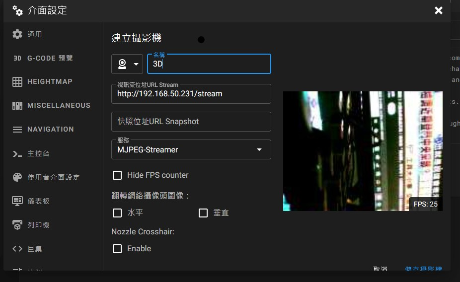
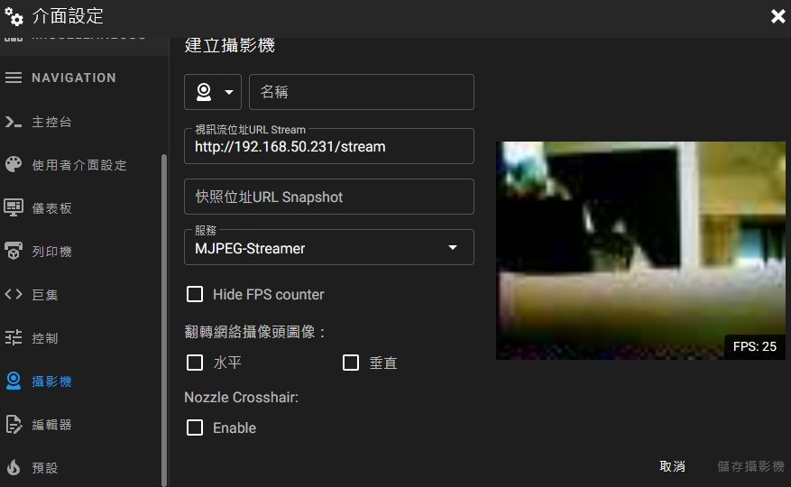

# ESP32-OV7670-Mjpeg-Camera

This project aims to provide an affordable MJPEG server for Klipper timelapse recording. I happened to have an OV7670 camera without FIFO on hand.

Realistically, unless you already own an ESP32 and an OV7670, or you can source incredibly cheap surplus units from a supplier, I would recommend purchasing a better model instead. Without sufficient memory, directly handling two buffers for data storage is an absolute nightmare.

## Features

Despite its low cost and limited memory, this project successfully streams an MJPEG server.

| Resolution | FPS | Sample Image |
|------------|-----|-------------|
| QVGA       | 7-8 |  |
| QQVGA      | 25  |  |
| QQQVGA     | 25  |  |

Due to memory limitations, VGA testing is not possible in my env.

## Wiring

| Camera Pin | ESP32 Pin |
|------------|----------|
| SIOD(SDA)  | 21       |
| SIOC(SCL)  | 22       |
| VSYNC      | 34       |
| HREF       | 35       |
| XCLK       | 32       |
| PCLK       | 33       |
| D0         | 27       |
| D1         | 17       |
| D2         | 16       |
| D3         | 15       |
| D4         | 14       |
| D5         | 13       |
| D6         | 12       |
| D7         | 4        |
| RESET      | 3.3V     |
| PWDN       | GND      |

## Additional Notes

If you're using an ESP32 Wrover or a higher-end model, you should be able to enable PSRAM. Once enabled, adjust `blockSlice` in the OV7670.cpp initialization to match the height of the image (Y-axis). This allows the camera to transmit data without block segmentation, potentially improving performance for resolutions above QVGA. You may even extend this capability to VGA.

## Acknowledgements

This project is based on:
- **[ESP32 I2S Camera](https://github.com/bitluni/ESP32CameraI2S#esp32-i2s-camera)** by bitluni
- **[ESP32-OV7670-WebSocket-Camera](https://github.com/mudassar-tamboli/ESP32-OV7670-WebSocket-Camera)** by mudassar-tamboli

## License

Since parts of the code are derived from the **esp-cam-demo**, which is subject to the Apache License 2.0, a notice is included at the beginning of the respective files. The rest of the code is released as **Public Domain**.
